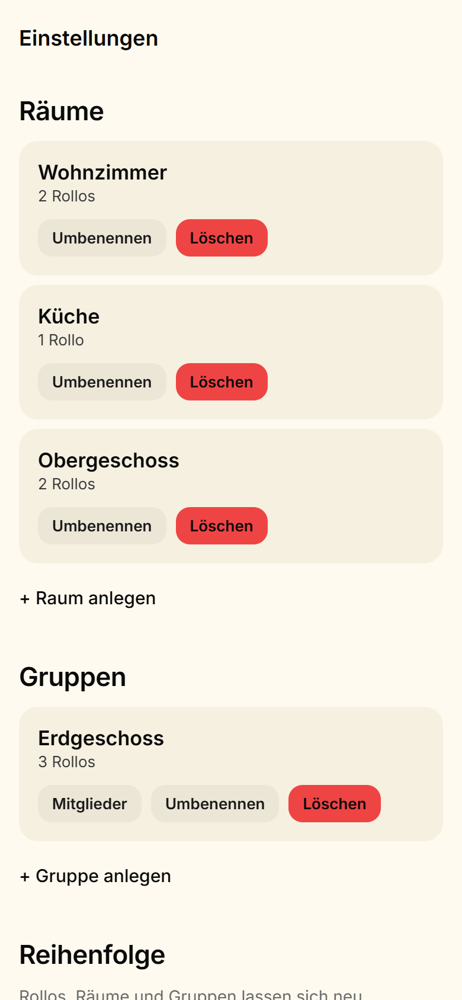
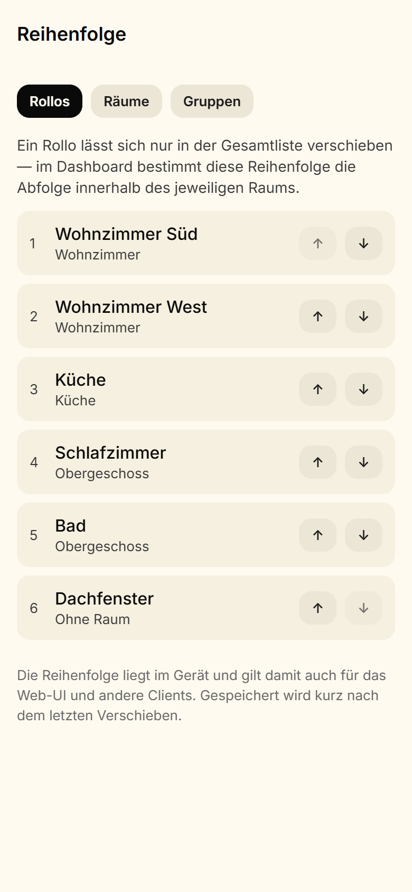
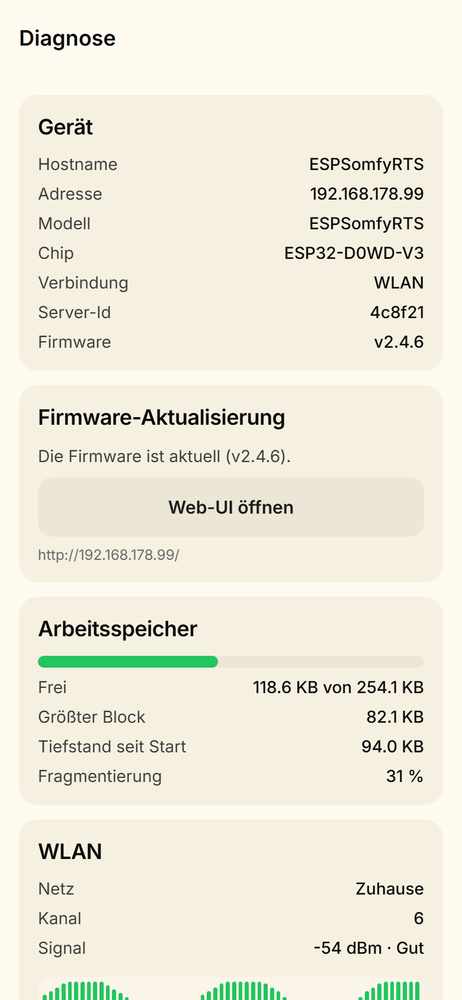

# ESPSomfy App

Mobile-App (Android, React Native/Expo) für [ESPSomfy-RTS](https://github.com/rstrouse/ESPSomfy-RTS)-Controller — steuert Somfy-RTS-Rollos über einen ESP32 im lokalen Netzwerk: Hoch / My / Runter, prozentgenaues Anfahren per Slider und Live-Status über WebSocket.

> **Hinweis:** Dies ist ein unabhängiges Client-Projekt. Es steht in keiner Verbindung zu [rstrouse/ESPSomfy-RTS](https://github.com/rstrouse/ESPSomfy-RTS) oder der Somfy SA. „Somfy" und „RTS" sind Marken der Somfy SA. An der Firmware wird nichts geändert — die App ist ein reiner Client.

## Screenshots

Die App folgt dem Systemthema; Hell und Dunkel teilen sich dieselben Markenfarben. Im hellen Modus füllt die Farbe des Rollos die Detailansicht, im dunklen bleibt sie Akzent auf dunklem Grund.

| Dashboard (hell) | Dashboard (dunkel) |
|---|---|
|  |  |

| Detailansicht (hell) | Detailansicht (dunkel) | Verbinden |
|---|---|---|
|  |  |  |

| Verwalten | Reihenfolge | Diagnose |
|---|---|---|
|  |  |  |

## Funktionen

**Steuern**

- Verbindung zum Controller per IP-Adresse, Login für alle drei Sicherheitsmodi der Firmware (keine Sicherung, PIN, Benutzer/Passwort)
- Dashboard mit allen Rollos, nach Räumen gruppiert; Gruppen stehen oben und erreichen alle ihre Motoren mit einem einzigen Funkbefehl
- Hoch / My / Runter — „My" wechselt kontextabhängig zwischen Stopp (bei Fahrt) und Favoritenposition
- Positions-Slider für prozentgenaues Anfahren
- Lamellen als eigene Achse für Rollos mit Tilt, inklusive der Rollos, die *nur* Lamellen haben
- Favoritenposition im Motor setzen und löschen (`/setMyPosition`)
- Live-Statusaktualisierung per WebSocket — auch wenn parallel die physische Fernbedienung benutzt wird
- Automatischer Reconnect mit Backoff, Polling-Fallback, Socket wird im App-Hintergrund geschlossen (Firmware erlaubt max. 5 Socket-Clients)
- Heller und dunkler Modus, folgt der Systemeinstellung oder wird fest gewählt

**Verwalten** (seit v3)

- Rollos umbenennen, einem Raum zuordnen, löschen
- Räume und Gruppen anlegen, umbenennen, löschen; Gruppenmitglieder zuordnen
- Reihenfolge von Rollos, Räumen und Gruppen ändern — sie liegt im Gerät und gilt damit auch für das Web-UI
- Diagnose: Gerätestatus, Heap mit Warnschwellen und Fragmentierungsgrad, Verlauf der WLAN-Signalstärke, Sicherung herunterladen, Neustart

**Bewusst nicht in der App:** Pairing, Fernbedienungs-Verwaltung, Repeater, Radio-/Frequenzeinstellungen, Firmware-Updates, Netzwerkkonfiguration, Zurückspielen einer Sicherung. Ein falscher Rolling Code oder eine falsche Frequenz trennt die Motoren, ein unterwegs abgebrochenes OTA-Update macht das Gerät unbrauchbar — solche Eingriffe gehören ins Web-UI der Firmware, in Reichweite des Geräts. Ein anstehendes Firmware-Update *zeigt* die App an und verlinkt dorthin.

## Voraussetzungen

- ESP32 mit [ESPSomfy-RTS-Firmware](https://github.com/rstrouse/ESPSomfy-RTS) (getestet gegen v2.4.6), eingerichtet und mit mindestens einem gepairten Rollo
- App und Controller im selben Netzwerk (LAN/WLAN)
- Android-Gerät (nur Android getestet)

## Installation

**APK aus den Releases:** Fertige APK unter [Releases](../../releases) herunterladen und installieren (Installation aus unbekannten Quellen muss erlaubt sein).

**Selbst bauen:**

```bash
npm install --legacy-peer-deps
npx eas-cli build --platform android --profile preview
```

Erfordert ein (kostenloses) Expo-Konto; das Profil `preview` erzeugt eine installierbare APK.

## Sicherheitshinweis

Die Verbindung zum Controller läuft über **unverschlüsseltes HTTP im lokalen Netzwerk** — so stellt die Firmware ihre API bereit. Für Zugriff von unterwegs ein **VPN ins Heimnetz** nutzen (z. B. WireGuard). **Kein Port-Forwarding** auf den Controller einrichten: Der Weg würde API und Rollosteuerung ungeschützt ins Internet stellen.

## Architektur

Der ESP32 bietet drei Schnittstellen:

| Port | Zweck |
|---|---|
| 80 | Voller Web-/Config-Server — die App nutzt ihn für **sämtliche Verwaltung** |
| 8081 | Reduzierter API-Server — Lesen, Fahrbefehle, Sicherung, Neustart |
| 8080 | WebSocket für Live-Status (proprietäres Frameformat `42[event,{...}]`) |

Die Verwaltungsrouten (`/saveShade`, `/addRoom`, `/shadeSortOrder`, `/setMyPosition`, …) sind auf 8081 **nicht** registriert. Die App hält deshalb zwei HTTP-Clients mit gemeinsamem Token.

```
app/                 Expo-Router-Screens
src/api/             HTTP-Client, Endpunkt-Wrapper, Auth
src/socket/          WebSocket-Client + Frame-Parser
src/store/           zustand-Slices (Shades, Groups, Rooms, Device, Connection)
src/models/          Typen + Enum-Mappings (gegen echtes Gerät validiert)
src/components/      UI-Komponenten
src/theme/           Design-Tokens
mock-server/         Node-Mock für Entwicklung ohne Hardware
docs/api-samples/    API-Antworten des Geräts (Firmware v2.4.6, anonymisiert)
docs/api-notes.md    Verifizierte Abweichungen Firmware-Doku ↔ echtes Gerät
docs/API-CLIENT-NOTES.en.md  Dieselben Befunde auf Englisch, für andere Client-Entwickler
```

Zentrale Eigenheiten der Firmware (Details in [docs/api-notes.md](docs/api-notes.md), englische Fassung mit Quellenangaben in [docs/API-CLIENT-NOTES.en.md](docs/API-CLIENT-NOTES.en.md)):

- Die WebSocket-Frames sind **kein gültiges JSON** (Event-Name ohne Anführungszeichen) — eigener Parser statt socket.io.
- Der API-Token ist an die **Client-IP gebunden** → Auto-Relogin bei 401/403.
- Max. **5 gleichzeitige Socket-Clients** → Socket wird im App-Hintergrund geschlossen.
- Positionswerte sind von der Firmware **bereits transformiert** (`flipPosition`) — die App spiegelt nie erneut.
- Mehrere Routen melden Fehler mit einem **2xx-Status** (`/reboot` und die `*SortOrder`-Routen antworten auf die falsche Methode mit HTTP 201 und `{"status":"ERROR"}`) — der Client prüft deshalb auch bei Erfolg den Rumpf.

## Entwicklung

**Stack:** React Native + Expo (SDK 57), TypeScript strict, Expo Router, zustand

```bash
npm install --legacy-peer-deps
npm start            # Expo Dev Server
npm run mock         # Mock-Server (HTTP + WebSocket) ohne Hardware
                     # Verwaltung liegt auf Port 80; unter Windows z. B. MOCK_CONFIG_PORT=8090
npm test             # Jest (175 Tests, u. a. Parser gegen echten Socket-Mitschnitt)
npm run lint         # ESLint
npm run typecheck    # tsc --noEmit
```

Die Planung läuft über GitHub Milestones und Issues; Änderungen laufen über Feature-Branches und PRs gegen `main`, referenziert auf ihr Issue (`Closes #n`).

## Lizenz

[MIT](LICENSE)
